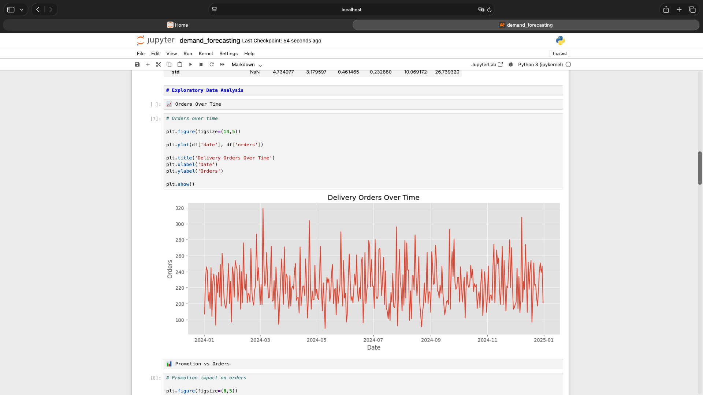
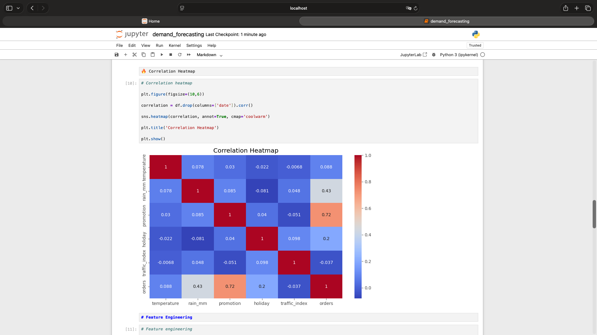
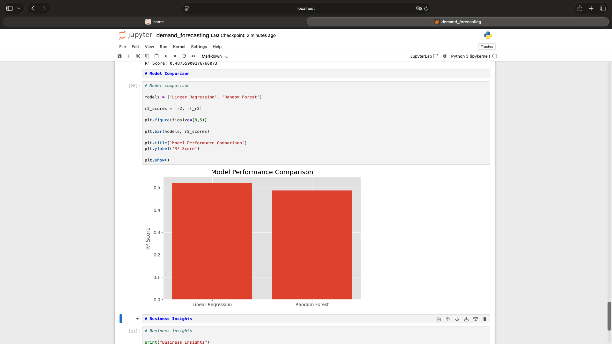

# 📦 Delivery Demand Forecasting


## 📖 Overview

This project focuses on predicting delivery demand using Machine Learning techniques and business-related variables such as weather conditions, promotions, holidays, and traffic data.

The objective is to help delivery companies optimize operations, improve resource allocation, and better understand customer demand patterns.

---

# 🚀 Technologies Used

- Python
- Pandas
- NumPy
- Matplotlib
- Seaborn
- Scikit-Learn
- Jupyter Notebook

---

# 📊 Business Problem

Delivery companies often face demand fluctuations caused by:
- weather conditions
- promotional campaigns
- holidays
- traffic behavior
- seasonality

Accurate demand forecasting helps businesses:
- reduce operational inefficiencies
- optimize staffing
- improve delivery performance
- enhance customer satisfaction

---

# 📁 Project Structure

```bash
delivery-demand-forecasting/
│
├── data/
├── notebooks/
├── images/
├── src/
├── README.md
└── requirements.txt
```

---

# 🔍 Exploratory Data Analysis

The project includes:
- Demand trend analysis
- Promotion impact analysis
- Weather impact analysis
- Correlation analysis

---

# 📈 Visualizations

## Orders Over Time



---

## Correlation Heatmap



---

## Model Performance Comparison



---

# 🧠 Feature Engineering

The following features were created to improve model performance:

- Day of Week
- Month
- Weekend Indicator

These features help capture:
- temporal patterns
- seasonality
- customer behavior

---

# 🤖 Machine Learning Models

Two regression models were implemented:

## Linear Regression
- Baseline predictive model

## Random Forest Regressor
- Ensemble learning model
- Better handling of non-linear relationships

---

# 📊 Model Evaluation

The models were evaluated using:

- MAE (Mean Absolute Error)
- RMSE (Root Mean Squared Error)
- R² Score

The Random Forest model achieved better predictive performance compared to Linear Regression.

---

# 💼 Business Insights

Key findings from the analysis:

- Promotional campaigns increased delivery demand.
- Rainy days showed higher order activity.
- Weekend demand patterns were identified.
- Random Forest outperformed Linear Regression.

---

# 🎯 Project Goals

This project demonstrates:
- Data Cleaning
- Exploratory Data Analysis
- Feature Engineering
- Predictive Modeling
- Model Evaluation
- Business-Oriented Analytics

---

# 📌 Future Improvements

Potential future enhancements:
- Time series forecasting models
- Hyperparameter tuning
- Real-world API integration
- Dashboard integration with Power BI

---

*Created by Brenda Espinosa*
